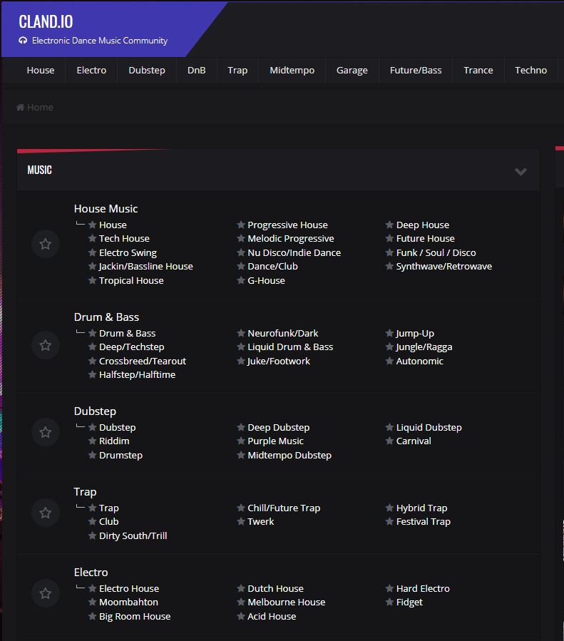

# ClandAutomator

This program automates the task of downloading mp3s from the cland.io website using UiPath as a web automation platform. 

### Site Structrue
The site is organized by genre with new topics to the forum acting as individual songs. The bot is capable of traversing multiple pages and only downloading songs from unread topics. The structure of the site is as follows:
Home Page
	- Genre (Electro House, Trance)
		- song topic (Tiesto - Lethal Industry)
			- download link (url)

### Queuing Genres
An excel file lives in the root folder of the program containing all the genres the user wants the bot to download. The genres must be typed exactly as it is typed on the website, and the bot will skip a genre that it cannot find. An example is shown below:

Electro House
House
Deep House
Tech House
G-House
Trance
Progressive Trance
Twerk
Grime
Ambient
BreakBeat/Breaks
Progressive House
Drum & Bass

### Sample Run
Lets say we only have "House" in the queue excel file and run the bot. Here is what it will do:

1. open the cland.io website (user should be logged in prior to running the bot)
2. middle mouse click all genres in the queue excel file (in this case just House music)
3. scrape the first house music page and look for any unread topics
4. middle click all unread topics if the number of unreads is greater than a user set minimum (i use 3)
5. for each of the opened topics, look on that page for a Mixcloud embedded iframe in the webpage
	- (Mixcloud is curently the hosting service cland uses for storing mp3 files)
	- if an embed doesnt exist or others (zipychare/soundcloud) are present, close the tab (these are rare so I dont care to miss them)
	- if a Mixcloud embed exists, navigate to the files webpage and download it to the user selected folder
6. once all unreads on that page are downloaded, move on to the next page and download all songs in the unread topics. Continue this until the number of unread topics on any page is below the user minimum. 

### Logging and Analytics

